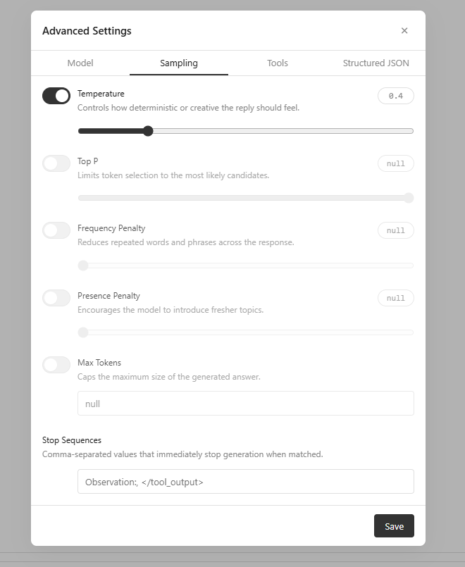

------
title: Sampling tab design normalization
created-at: 02/04/2026, 16:02:03
order: 9
author: CypherPotato
------
The whole interface is square, but this page deviates a bit from the established styles of the site components, which have a smaller border radius, fewer details, etc. Normalize the styles of this tab a bit.

